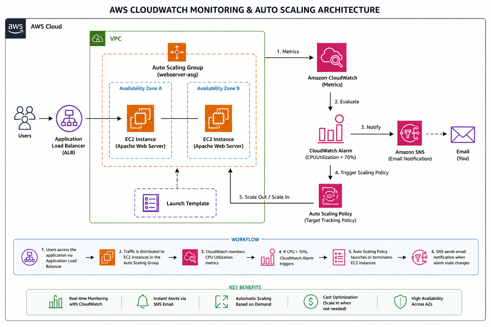

<div align="center">

# ☁️ AWS CloudWatch Monitoring & Auto Scaling Project

### Real-Time Infrastructure Monitoring, Alerting & Dynamic Scaling on AWS

<p align="center">
  
</p>

<br>


</div>

---

# 📌 Project Overview

Modern applications must remain highly available under varying traffic loads while minimizing infrastructure costs.

This project demonstrates how AWS CloudWatch, SNS, EC2, Launch Templates, Load Balancing, and Auto Scaling Groups can be integrated to create a self-monitoring and self-scaling cloud infrastructure.

The solution continuously monitors EC2 CPU utilization, generates alerts when thresholds are exceeded, and automatically adjusts infrastructure capacity based on workload demand.

---

# 🎯 Problem Statement

Organizations often face two major challenges:

### High Traffic

- Increased user traffic can overload servers.
- Performance degradation impacts user experience.
- Manual scaling causes delays.

### Low Traffic

- Idle servers increase cloud costs.
- Resources remain underutilized.

This project addresses both challenges through automated monitoring and scaling mechanisms.

---

# 🚀 Solution

The implemented solution provides:

✅ Real-time infrastructure monitoring

✅ Automated alert generation

✅ Email notifications using Amazon SNS

✅ Dynamic resource scaling

✅ Improved application availability

✅ Reduced operational overhead

✅ Cost optimization through automated scale-in

---

# 🏗 Solution Architecture

<p align="center">
  
</p>

---

# 🔄 Architecture Workflow

## Step 1 – User Traffic

Users access the application through an Application Load Balancer (ALB).

---

## Step 2 – Traffic Distribution

The ALB distributes incoming requests across EC2 instances managed by an Auto Scaling Group.

---

## Step 3 – Metrics Collection

Amazon CloudWatch continuously collects:

- CPU Utilization
- Network Metrics
- Instance Health Metrics
- Resource Utilization Statistics

---

## Step 4 – Alarm Evaluation

CloudWatch evaluates CPU thresholds.

Example:

```text
CPU Utilization > 70%
```

---

## Step 5 – Alert Generation

CloudWatch Alarm enters the ALARM state.

---

## Step 6 – Notification Delivery

Amazon SNS sends email notifications to subscribed users.

---

## Step 7 – Auto Scaling Decision

Target Tracking Policy evaluates:

```text
Average CPU Utilization = 50%
```

---

## Step 8 – Scale Out

When utilization remains above target:

- Additional EC2 instances are launched.
- Traffic is redistributed automatically.

---

## Step 9 – Scale In

When utilization decreases:

- Extra instances are terminated.
- Infrastructure costs are reduced.

---

# ☁️ AWS Services Used

| Service | Purpose |
|----------|----------|
| Amazon EC2 | Application Hosting |
| Amazon CloudWatch | Monitoring & Metrics Collection |
| CloudWatch Alarms | Threshold-Based Alerting |
| Amazon SNS | Email Notifications |
| Auto Scaling Groups | Dynamic Capacity Management |
| Launch Templates | Standardized EC2 Deployment |
| Application Load Balancer | Traffic Distribution |

---

# ⚙️ Infrastructure Configuration

## EC2 Instance

| Parameter | Value |
|------------|---------|
| Operating System | Amazon Linux |
| Web Server | Apache HTTP Server |
| Monitoring Metric | CPU Utilization |

---

## CloudWatch Alarm

| Parameter | Configuration |
|------------|---------------|
| Metric | CPUUtilization |
| Threshold | 70% |
| Evaluation Period | 5 Minutes |
| Action | SNS Notification |

---

## SNS Notification

| Parameter | Configuration |
|------------|---------------|
| Protocol | Email |
| Topic | cloudwatch-alerts |
| Purpose | Alarm Notifications |

---

## Auto Scaling Group

| Parameter | Configuration |
|------------|---------------|
| Minimum Capacity | 1 |
| Desired Capacity | 1 |
| Maximum Capacity | 3 |

---

## Target Tracking Policy

| Parameter | Configuration |
|------------|---------------|
| Metric | Average CPU Utilization |
| Target Value | 50% |
| Instance Warmup | 300 Seconds |
| Scale In | Enabled |

---

# 🛠 Implementation Steps

## 1. Launch EC2 Instance

- Created Amazon Linux EC2 instance
- Configured security groups
- Installed Apache Web Server
- Verified application accessibility

---

## 2. Configure CloudWatch Monitoring

- Enabled EC2 monitoring
- Verified CPU metrics collection
- Created CloudWatch visualizations

---

## 3. Create CloudWatch Alarm

Configured an alarm based on:

```text
CPUUtilization > 70%
```

---

## 4. Configure SNS Notifications

- Created SNS Topic
- Added Email Subscription
- Confirmed Subscription
- Tested Notification Delivery

---

## 5. Create Launch Template

Configured:

- AMI
- Instance Type
- Security Groups
- User Data Script

---

## 6. Create Auto Scaling Group

Configured capacity settings:

```text
Min = 1
Desired = 1
Max = 3
```

---

## 7. Configure Dynamic Scaling

Created Target Tracking Policy:

```text
Target CPU Utilization = 50%
```

---

## 8. Generate Load

Connected to EC2:

```bash
ssh -i key.pem ec2-user@PUBLIC_IP
```

Installed stress utility:

```bash
sudo yum install stress -y
```

Generated CPU load:

```bash
stress --cpu 8 --timeout 900
```

---

## 9. Validate Monitoring & Scaling

Observed:

- CPU utilization increased to ~100%
- CloudWatch Alarm triggered
- SNS notifications delivered
- Auto Scaling policy evaluated load
- Additional instances launched

---

# 📊 Results

## Monitoring

✅ Successfully monitored EC2 performance

✅ Real-time CloudWatch metrics available

---

## Alerting

✅ Alarm triggered when CPU crossed threshold

✅ Email notifications delivered successfully

---

## Scaling

✅ Auto Scaling Group responded to load

✅ Additional capacity provisioned automatically

---

## Reliability

✅ Improved application availability

✅ Reduced risk of performance bottlenecks

---

# 📈 Key Outcomes

### Monitoring

- CloudWatch Metrics
- Dashboards
- Alarm Management

### Alerting

- SNS Integration
- Email Notifications
- Event Detection

### Scalability

- Auto Scaling Groups
- Target Tracking Policies
- Capacity Management

### Reliability

- High Availability
- Load Distribution
- Fault Tolerance

---

# 🎓 Skills Demonstrated

### Cloud Computing

- AWS EC2
- CloudWatch
- SNS
- Auto Scaling

### DevOps

- Infrastructure Monitoring
- Performance Analysis
- Capacity Planning
- System Reliability

### Linux Administration

- Apache Configuration
- Server Monitoring
- Resource Management

---

# 🔮 Future Enhancements

- Infrastructure as Code using Terraform
- CI/CD using GitHub Actions
- Docker Containerization
- Kubernetes Deployment
- Prometheus Monitoring
- Grafana Dashboards
- CloudWatch Logs Integration
- Cost Optimization Analytics

---

# 📂 Repository Structure

```text
AWS-CloudWatch-Monitoring-Auto-Scaling-Project/
│
├── README.md
│
├── architecture/
│   └── architecture-diagram.png
│
└── screenshots/
    ├── cloudwatch-metrics.png
    ├── cpu-alarm-triggered.png
    ├── autoscaling-policy.png
    ├── two-instances-running.png
    └── scale-out-activity.png
```

---

# 👨‍💻 Author

## Jakkali Lokesh

Cloud Engineer | DevOps Engineer | SOC Analyst

### Connect With Me

- GitHub: https://github.com/jakkalilokesh
- LinkedIn: https://www.linkedin.com/in/jakkalilokesh

---

<div align="center">

### ⭐ If you found this project useful, consider starring the repository.

</div>
